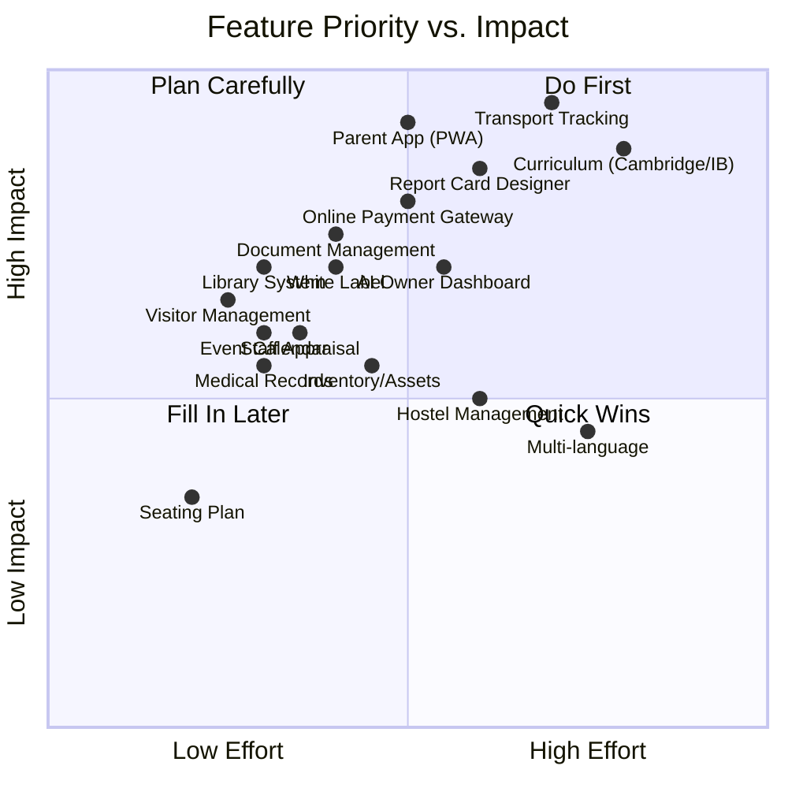

# 🏫 AltRix — Elite School Feature Strategy

## What You Already Have (Your Strengths)

After deep-diving your entire codebase, AltRix already has a **strong foundation**:

| Domain | What Exists |
|--------|-------------|
| **Multi-Tenancy** | Full SaaS: schools, campuses, multi-role (owner, principal, VP, teacher, student, parent, HR, accountant, marketing, counselor, coordinator) |
| **Academics** | Classes, sections, subjects, timetable builder, lesson planner |
| **Exams** | Exams, datesheets, results, report cards, hall tickets, assessments |
| **Attendance** | Student + staff attendance, sessions, heatmaps |
| **Finance** | Fee structures, vouchers, payments (JazzCash), invoices, ledger, payroll, tax, vendors, expenses |
| **HR** | Staff directory, contracts, recruitment, onboarding, leaves, salary records, reviews |
| **Communications** | Admin messaging with reactions/pins, notices, notifications, complaints with feedback threads, diary entries |
| **Assignments** | Full assignment → submission → grading pipeline with late penalties |
| **AI Layer** | Copilot, early warnings, student profiles, career suggestions, counseling queue, teacher performance, reputation dashboard, predictive models, semantic cache |
| **Marketing/CRM** | Leads, campaigns, calls, follow-ups, intake, templates, sources, reports |
| **Infrastructure** | Offline support, WebSocket realtime, push notifications, audit logs, event bus, brute-force protection, rate limiting, input sanitization, backup service |

---

## What Elite Schools WILL Ask For (And Why They'd Reject You Without Them)

> [!IMPORTANT]
> Elite schools (Aitchison, LGS, Beaconhouse, City School, Roots, KIGS, etc.) already use systems like **PowerSchool, ManageBac, FACTS, Veracross, or custom ERP**. To make them switch, you need features that those systems either lack or do poorly.

---

### 🔴 TIER 1 — Deal Breakers (They won't even consider you without these)

#### 1. **Parent Mobile App (PWA → Native-Feel)**
**Current Gap**: You have parent modules on the web, but elite parents expect a **dedicated mobile app** experience.

**What They Expect**:
- Instant push notifications for attendance, grades, fees
- One-tap fee payment with receipt download
- Live GPS bus tracking
- Photo/video gallery from school events
- Parent-teacher meeting booking
- Quick contact to class teacher
- Child's daily schedule at a glance

**Why It Kills Deals**: *"Where is the app?"* is literally the first question every school owner asks.

---

#### 2. **Transport / School Bus Tracking** *(Completed in Phase 1)*
**What They Expect**:
- Routes, stops, bus assignments
- Live GPS tracking visible to parents
- Driver/conductor profiles
- Pick-up/drop-off notifications
- Route optimization
- Emergency alerts

**Why It Kills Deals**: Transport is the #1 parent complaint vector. Schools that solve it win parents.

---

#### 3. **Library Management System** *(Completed in Phase 1)*
**What They Expect**:
- Book catalog with ISBN, barcode scanning
- Issue/return tracking
- Fine management
- Reservation system
- Reading history per student
- Integration with academic recommendations
- E-library / digital resources links

---

#### 4. **Inventory & Asset Management**
**Current Gap**: Missing. Elite schools have labs, sports equipment, IT assets, uniforms.

**What They Expect**:
- Asset register (computers, projectors, lab equipment, furniture)
- Allocation to rooms/departments
- Maintenance scheduling
- Procurement requests with approval workflows
- Uniform/bookshop inventory
- Low-stock alerts

---

#### 5. **Hostel / Boarding Management**
**Current Gap**: Missing. Many elite schools (especially in Punjab/KPK) have boarding facilities.

**What They Expect**:
- Room allocation
- Mess management & meal plans
- Hostel attendance (separate from class)
- Guardian visit tracking
- Medical incident logging
- Warden reports

---

### 🟠 TIER 2 — Competitive Differentiators (What makes them choose YOU over competitors)

#### 6. **Advanced Report Card Designer**
**Current State**: You have `ReportCardModule.tsx` (80KB — substantial), but elite schools want:

- **Fully customizable templates** (Cambridge, Matric, IB, O-Level, A-Level formats)
- Position-in-class ranking
- Subject-wise teacher comments (not just general remarks)
- Co-curricular grades (sports, arts, debate)
- Effort vs. achievement grades
- Year-over-year trend graphs embedded in report cards
- Multi-language report cards (Urdu + English)
- Digital signatures with QR verification

---

#### 7. **Curriculum Framework Support (Cambridge, IB, Matric)**
**Current Gap**: Your academic model is generic. Elite schools following Cambridge/IB need:

- **Learning Objectives (LOs)** mapped to subjects
- Strand-based assessment tracking
- Curriculum coverage reports (% of LOs taught)
- Grade boundary configuration (A*, A, B, C... or 1-7 for IB)
- Criterion-referenced assessment for IB (Criteria A, B, C, D)

---

#### 8. **Online Fee Payment Portal for Parents (Full Gateway)**
**Current State**: JazzCash integration exists, but elite parents expect:

- **Credit/debit card payments** (Stripe/HBL/Meezan gateway)
- Auto-generated receipts as PDFs
- Payment plans / installment options
- Sibling discount automation
- Outstanding balance dashboard
- Fee defaulter escalation workflow (SMS → Warning letter → Meeting → Suspension)
- Tax certificate generation (annual)

---

#### 9. **Visitor Management System**
**Current Gap**: Missing.

- Visitor pre-registration by parents
- QR/OTP check-in at gate
- Photo capture
- Purpose tracking (meeting, pickup, delivery)
- Badge printing
- Blacklist management
- Integration with student pickup authorization

---

#### 10. **Events & Calendar Management**
**Current Gap**: You have `Holiday` model but no full events system.

- School-wide event calendar
- Event RSVPs from parents
- Photo/video galleries per event
- Sports day scorecards
- Annual function planning
- PTM (Parent-Teacher Meeting) slot booking
- Event notifications to specific roles/classes

---

### 🟡 TIER 3 — "Wow Factor" Features (What makes them say "this is the future")

#### 11. **AI-Powered Insights Dashboard for Owners**
**Current State**: You have AI models but they need a **unified command center** for school owners.

**What Elite Owners Want**:
- Revenue forecasting
- Enrollment trend predictions
- Teacher retention risk scores
- Parent satisfaction sentiment analysis
- Competitive positioning (benchmark against other schools)
- Board-ready presentation exports

---

#### 12. **Document Management System (DMS)** *(Completed in Phase 1)*
- Student document vault (birth certificate, previous school TC, photos, medical)
- Staff document vault (CV, degrees, CNIC, contracts)
- Template engine for: Transfer Certificate, Character Certificate, Bonafide, NOC
- Digital signatures
- Document expiry alerts (CNIC, contracts)

---

#### 13. **Examination Hall Seating Plan Generator**
**Current Gap**: Missing. Elite schools with 1000+ students need this.

- Auto-generate seating arrangements
- No same-class students adjacent
- Room capacity management
- Print-ready seating charts
- Invigilator assignment

---

#### 14. **Staff Appraisal & KPI System**
**Current State**: `AiTeacherPerformance` exists but is AI-only. Schools want:

- Manual KPI definition (punctuality, results, parent feedback, co-curricular contribution)
- Self-appraisal submissions
- HOD/Principal review workflow
- 360° feedback (students rate teachers anonymously)
- Performance improvement plans
- Linked to salary increments

---

#### 15. **White-Label & Custom Domain**
**Current State**: You have `PlatformDomainsPage.tsx` and `SchoolBranding` — this is partially there.

**What's Missing**:
- Full white-label (remove AltRix branding completely)
- Custom email notifications from school's domain
- School-branded login page
- Custom mobile app icon & splash screen
- Custom color themes beyond HSL accent

---

#### 16. **Student Wellbeing & Medical Records**
**Current State**: You have counseling queue but no medical records.

- Medical history (allergies, conditions, medications)
- Infirmary visit logs
- Vaccination records
- First-aid incident reports
- Health insurance information
- Doctor/hospital contact directory
- Wellbeing check-in surveys

---

#### 17. **Multi-language & RTL Support**
**Current Gap**: Everything is English-only.

- Urdu interface for admin staff
- Arabic support for Middle East expansion
- RTL layout support
- Multi-language notifications (SMS in Urdu)

---

## Implementation Priority Matrix

---

## Recommended Phase Plan

### Phase 1 — "Minimum Elite" (Completed)
- 🚌 **Transport Management** (routes, buses, driver profiles, parent GPS notifications) — **DONE**
- 📱 **Parent PWA Enhancement** (app-like experience, one-tap actions) — **DONE**
- 📚 **Library Management System** — **DONE**
- 📄 **Document Management + Certificate Templates** (TC, Character, Bonafide, NOC with QR code) — **DONE**
- ⚙️ **Super Master Admin Feature Toggles per tenant** — **DONE**

### Phase 2 — "Win the Demo" (Next Release)
- 📊 **Advanced Report Card Designer** (Cambridge/IB/Matric templates)
- 🎯 **Curriculum Framework + Learning Objectives**
- 🏥 **Student Medical Records + Infirmary & Wellbeing**
- 👥 **Visitor Management System & Gate Console**
- 📅 **Events & Calendar + PTM Slot Booking**

### Phase 3 — "Market Domination"
- 🏠 **Hostel/Boarding Management**
- 📦 **Inventory & Asset Management**
- ⭐ **Staff Appraisal & 360° KPI System**
- 🏷️ **Full White-Label & Custom Domain System**
- 🌐 **Multi-language (Urdu + RTL)**
- 🪑 **Exam Seating Plan Generator**
- 📈 **AI Owner Command Center (Unified Analytics)**

---

## The "Killer Pitch" — What AltRix Has That Others Don't

> [!TIP]
> When pitching to elite schools, lead with what **no competitor** offers:

1. **AI Copilot per role** — No school ERP has a per-role AI assistant that answers questions from live data
2. **Student Digital Twin** — Holistic student profile combining academics + behavior + attendance + AI predictions
3. **Early Warning System** — AI-detected at-risk students before they fail
4. **Career Path AI** — Personalized career suggestions based on student performance patterns
5. **School Reputation Dashboard** — NPS score, parent satisfaction, community metrics
6. **Event-Driven Architecture** — Every action in the system creates a traceable event (audit-grade)
7. **Offline-First** — Works even when internet is down (huge for Pakistani infrastructure)
8. **Real-time Everything** — WebSocket-powered live dashboards, presence tracking, typing indicators
